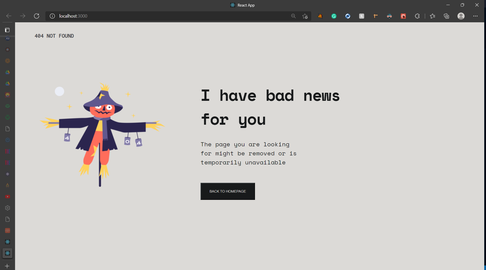
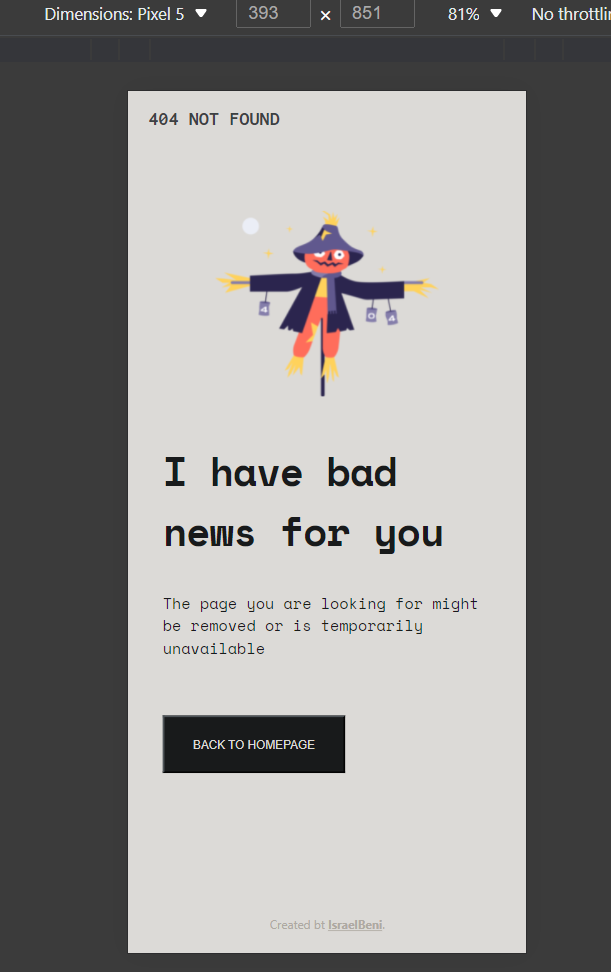

# Error-404
In this project, I created a custom 404 error page following a figma design by **devChallenges**. The resultant web page is a response react app.
This project was bootstrapped with [Create React App](https://github.com/facebook/create-react-app).

## Table of Contents

* [Source](#souce)
* [Technologies](#technologies)
* [Demo](#demo)
* [Setup](#setup)

## Source

This project is inspired by **devChallenges.io** which also provided the figma design I used.

## Technologies

For the development of the app, I used:

* React.js 17.0.2
* HTML5
* CSS3

## Demo

Here is how my custom 404 error page looks like:

* On Desktop

* On Mobile

## Setup

To run this project on your computer:

### Clone this repository

 on you computer.

### `npm start`

Runs the app in the development mode.\
Open [http://localhost:3000](http://localhost:3000) to view it in your browser.

The page will reload when you make changes.\
You may also see any lint errors in the console.

### NB

Make sure that you have Node installed on your computer before running the above command.
